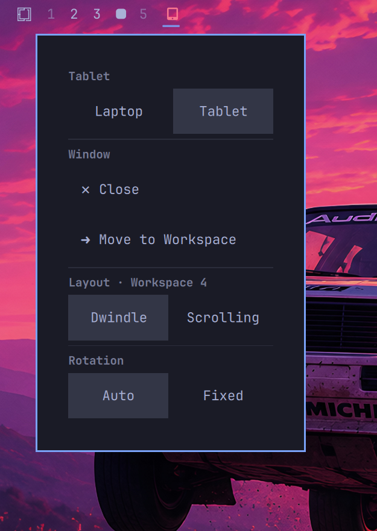

# Omarchy Tablet Experience（平板体验）

**为可拆卸二合一笔记本打造的 Laptop / Tablet 模式插件**，运行在 Omarchy（Quattro）+ Hyprland 之上。
开发并在联想 ThinkPad X12 Detachable Gen 1 上验证：传感器旋转、虚拟键盘手势、键盘自动模式切换、以及面向触控的窗口管理弹层，全部收进一个插件。

[English: README.md](README.md) · [开发日志 / Development log](DEVELOPMENT.md)



## 功能特性

- **Laptop ⇄ Tablet 状态机** — 跨 shell 重启持久化，OSD 反馈，IPC 可控。
- **旋转** — 手动四向循环（`SUPER+SHIFT+R`）、传感器自动跟随（iio-sensor-proxy）、或平板弹层里的 ⟲/⟳ 90° 步进按钮。**切换进 tablet 模式时屏幕不会再自动旋转**（v1.4）：保持当前角度不动，只有显式操作、或 preset=auto 时按传感器识别的方向才旋转。触摸校准随屏幕一起旋转（Hyprland 自身不会做这件事）。**选择 Laptop 模式时屏幕必定回到默认 0° 横向**——即使旋转还在进行中，重置也会排队等它完成。
- **虚拟键盘** — squeekboard，`SUPER+U`、顶部栏键盘按钮（仅平板模式，高亮表示可见）或三指轻点（`texp-touch`）。**屏幕底部上滑手势自 v1.2.1 起默认关闭**；想恢复就在 `~/.config/hypr/autostart.lua` 加一行 `o.launch_on_start("texp-vk daemon")`。`install.sh` 会为用户授予 evdev 访问权限（udev `uaccess` 规则 + `input` 用户组），手势守护进程重启后仍可正常读取触摸屏。
- **平板简化顶栏（v1.2，v1.3 增强）** — LAPTOP 模式保留默认完整图标；TABLET 模式只留必要项（菜单 · 工作区 · 时钟 · 托盘 · 网络 · 音量 · 电源 · 本插件），其余（天气、状态指示灯、蓝牙、tailscale、显示器、更新、场景切换、键盘布局等）收进 **⋮ 溢出弹层**：栏上保持两个核心快捷按钮（输入法 EN⇄中 + 虚拟键盘）；弹层里每个图标是 **on/off 开关**（✓=在栏上，点一下隐藏；空=隐藏，点一下显示），还有 **Hide all / Show all** 一键整体切换。精简前的原始布局保存在 shell.json 里（`bar.layoutSnapshot`，bar 不渲染该键），切回 laptop 时原样恢复，重启/崩溃都不丢。
- **输入法快速切换** — 顶部栏按钮（**仅平板模式显示**）显示当前 fcitx5 输入法（EN / 中 / …），点一下即切换（`fcitx5-remote -t`）——补上被隐藏的 fcitx5 切换按钮没有的便利。
- **语音输入（v1.5，⏎ v1.6，平板模式）** — 顶栏**麦克风图标**打开屏幕底部的一个「按住说话」按钮（再点一次图标可关闭）。按住按钮用 **voxtype** 语音识别（本地 ASR，不上云），松开即转写并输入到光标处——`wtype` 完整支持中文。按钮下方新增 **⏎ Enter 按钮**，点一下发送回车提交（聊天 / 终端 / 搜索框）。按钮实时显示 录音 / 识别中 状态，与 F9 / SUPER+CTRL+X 热键同步。
- **顶部栏拍击显隐（平板模式）** — 没有鼠标就没有悬停，所以在 bar 上方放一条全宽的细边缘条：隐藏时轻点顶部 → 显示，再点一次 → 隐藏（驱动 Omarchy 自己的 `bar-off` 开关）。
- **顶部栏拍击显隐（平板模式）** — 没有鼠标就没有悬停，所以在 bar 上方放一条全宽的细边缘条：隐藏时轻点顶部 → 显示，再点一次 → 隐藏（驱动 Omarchy 自己的 `bar-off` 开关）。
- **多点触控手势**（`texp-touch`，被动 evdev 监听、不抢占设备）— 双指轻点：关闭手指下的面板/窗口 · 双指左/右滑：上一个/下一个工作区 · 双指下滑：呼出 Omarchy 菜单 · 单指轻点：聚焦被点窗口（Hyprland 触摸从不聚焦）。
- **键盘自动模式切换** — 接上键盘 → laptop 模式，拆下 → tablet 模式（USB 存在性检测，默认开启）。
- **平板窗口管理** — 平板模式下 bar 按钮弹出：关闭最近触摸的窗口 ✕、移动到工作区 1–10、切换布局 Dwindle/Scrolling。只瞄准可见窗口，操作有通知反馈。
- **触摸工作区滑动** — 启用 Hyprland 原生手势。
- **可选中文输入法** — fcitx5 + Rime（`--with-ime`，见安装）。

## 系统要求

- Omarchy 4.x（Quickshell shell）、Hyprland 0.56+（Lua 配置 API）、Arch 系系统（可选依赖走 `pacman`）。
- 带触摸屏、加速度计、可拆键盘的二合一设备。默认面向 **ThinkPad X12**（folio 键盘 USB `17ef:60fe`、Wacom 触摸屏）；所有硬件假设均可覆盖——见[配置](#配置)。

## 安装

```sh
# 1. 插件本体（QML service + bar widget）：
omarchy plugin add https://github.com/gmaxxxie/omarchy-tablet-experience.git --enable

# 2. 系统侧（helper 守护进程、Hyprland 钩子、依赖包）：
~/.config/omarchy/plugins/maxt.tablet-experience/install.sh
```

仓库根目录就是插件目录，所以第 1 步之后克隆位于
`~/.config/omarchy/plugins/maxt.tablet-experience`，`install.sh` 直接在那里运行（从开发克隆跑也行）。

`install.sh` 选项：

| 参数 | 作用 |
|---|---|
| （无） | 部署守护进程 + Hyprland 钩子 + 必选依赖包 |
| `--no-packages` | 跳过 pacman（手动装依赖） |
| `--with-ime` | 加装中文输入法（fcitx5-rime、librime、中文字体） |
| `--with-camera` | 加装 libcamera（浏览器摄像头） |
| `--dry-run` | 只预览，不修改任何东西 |
| `--verify` | 升级后自检（只读，见"升级与安全"） |

安装内容：8 个 helper 守护进程到 `~/.local/bin`、一份 `tablet-experience.lua` Hyprland 配置（触摸滑动 + 三个按键绑定 + 顶部栏条的 z-index，并在你的 `hyprland.lua` 追加一行 `require`）、`autostart.lua` 里的自启钩子（`texp-vk` / `texp-touch`）、以及**手势守护进程的 evdev 访问权限**：项目自带的 udev 规则给 `/dev/input/event*` 打上 `uaccess` 标签（下次开机起 logind 会给当前活动会话授读 ACL），并把你加入 `input` 用户组（之后的每次登录都保证生效；想立刻在当前会话生效可执行 `newgrp input -c 'texp-vk daemon'`）。所有被改动的文件都会先留 `*.bak.<时间戳>` 备份。

**安装后重新登录一次**，让 shell 全新加载插件，然后用 `install.sh --verify` 验证。

## 使用方法

| 操作 | 输入 |
|---|---|
| 切换 Laptop/Tablet 模式 | `SUPER+SHIFT+U`（或 bar 按钮左键） |
| 下一个旋转预设 | `SUPER+SHIFT+R`（或 bar 按钮右键） |
| 切换输入法（EN ⇄ 中） | **bar 按钮（仅平板模式）**（显示当前输入法） |
| 语音输入（按住说话） | **麦克风 bar 按钮（仅平板模式）** → 底部按钮：按住录音，松开转写；**⏎ Enter** 提交；再点麦克风图标关闭 |
| 被收纳的顶栏图标（平板） | **⋮ 按钮** → 每个图标 on/off 开关 + Hide all / Show all |
| 虚拟键盘 | `SUPER+U` · **顶部栏键盘按钮（仅平板模式）** · 三指轻点（v1.2.1 起默认关闭底部上滑手势） |
| 显示/隐藏顶部栏（平板模式） | 轻点屏幕顶部边缘 / 顶部栏空白处（隐藏时 16px、显示时 5px） |
| 关闭面板/被触摸窗口 | 双指轻点 |
| 上一/下一工作区 | 双指左/右滑 |
| Omarchy 菜单 | 双指下滑 |

平板模式下 bar 按钮打开**窗口管理弹层**：先点一下目标窗口，再执行 关闭 ✕ / 移动到工作区 1–10 / Dwindle·Scrolling 布局切换。

IPC（`omarchy-shell maxt.tablet-experience <方法>`）：
`getState` · `getMode` · `toggle` · `setMode <laptop|tablet>` ·
`setRotation <off|auto|0|1|2|3>` · `setAutoOrient <on|off>` ·
`setAutoSwitch <on|off>` · `voiceInputToggle|voiceInputShow|voiceInputHide`（v1.5）。

## 配置

硬件默认值面向 ThinkPad X12；这些变量可在登录前写入环境（例如 `~/.config/environment.d/60-tablet-experience.conf`）：

| 变量 | 含义 | 默认值 |
|---|---|---|
| `OMARCHY_ROTATE_DISPLAY` | 要旋转的显示器 | 第一个 Hyprland 显示器 |
| `OMARCHY_KB_VENDOR` / `OMARCHY_KB_PRODUCT` | 可拆键盘 USB ID | `17ef` / `60fe` |
| `OMARCHY_TOUCH_NAME` | 匹配触摸屏设备名的一组子串（空格分隔） | `wacom finger` |

手势时间/容差常量在 `texp-touch` / `texp-vk` 文件顶部。自动模式切换默认开启；用 `setAutoSwitch off` 关闭。

## 依赖

必选（默认安装）：

- `squeekboard` — 屏幕键盘
- `iio-sensor-proxy` — 加速度计姿态（自动旋转）
- `python-evdev` — 两个手势守护进程

可选：

- `voxtype`（AUR：`voxtype-bin`）— 语音输入（平板按住说话，v1.5）；另需 `wtype` 在 Wayland 下打字。本机已装好。
- `fcitx5-rime`、`librime`、`noto-fonts-cjk`、`wqy-microhei`（中文输入法，`--with-ime`）
- `libcamera`（浏览器可用摄像头，`--with-camera`）

helper 脚本本身只需 Python 3 / bash 和 `hyprctl`。

## 卸载

```sh
~/.config/omarchy/plugins/maxt.tablet-experience/uninstall.sh   # 系统侧
omarchy plugin remove maxt.tablet-experience                     # 插件本体
```

`uninstall.sh` 只删除与安装内容逐字节一致的文件——你改过的会被保留并提示。依赖包不会自动卸载（会打印清单）。

## 升级与安全

- **插件从不修改 Omarchy 包文件** —— 已用 `pacman -Qkk omarchy` 验证（0 个文件被改动）。所有变更都在用户配置区和官方扩展点（`plugins/`、菜单 jsonc、`autostart.lua` 的 `o.launch_on_start`、`hyprland.lua` 的一行 `require`）。系统升级最坏情况是新默认文件以 `.pacnew` 出现、钩子消失——可见、绝不具破坏性。
- **任何系统升级后，跑一遍自检：**

  ```sh
  ~/.config/omarchy/plugins/maxt.tablet-experience/install.sh --verify
  ```

  检查 8 个 helper 脚本、Hyprland 钩子、插件启用状态、实时按键绑定和守护进程——只读，发现问题 exit 1。恢复动作永远是同一条幂等的 `install.sh`。
- helper 使用保留前缀 `texp-*`，永远不会与官方 `omarchy-*` 工具互相遮蔽。

## 仓库结构

```
omarchy-tablet-experience/            ← 仓库根 = 插件根
├── manifest.json                  ← 插件清单（service + bar-widget）
├── Service.qml                    ← 状态机 + IPC + 自动旋转/切换
├── BarWidget.qml                  ← 常驻 bar 按钮 + 弹层
├── install.sh / uninstall.sh      ← 一键安装/卸载（可逆）
├── scripts/                       ← helper 守护进程（自动装到 ~/.local/bin）
│   ├── texp-vk                    ← 虚拟键盘开关 + 底部上滑守护进程
│   ├── texp-touch                 ← 多点触控手势 + 最近触摸追踪
│   ├── texp-close                 ← 关闭面板/覆盖层/被触摸窗口
│   ├── texp-window                ← 平板操作（关闭/移动/布局）
│   ├── texp-rotate                ← 旋转（同步触摸设备矩阵）
│   ├── texp-orient                ← IIO 加速度计姿态探测
│   ├── texp-kbdetect              ← 可拆键盘 USB 存在性检测
│   └── texp-bar-probe             ← uinput 诊断工具（bar 触摸命中验证）
├── config/hypr/tablet-experience.lua  ← 按键绑定 + 触摸滑动（安装并挂钩）
├── README.md / README.zh-CN.md    ← 用户文档（英文 / 中文）
├── DEVELOPMENT.md                 ← 完整开发日志 + 硬件审计
└── LICENSE
```

## 许可证

MIT — 见 [LICENSE](LICENSE)。